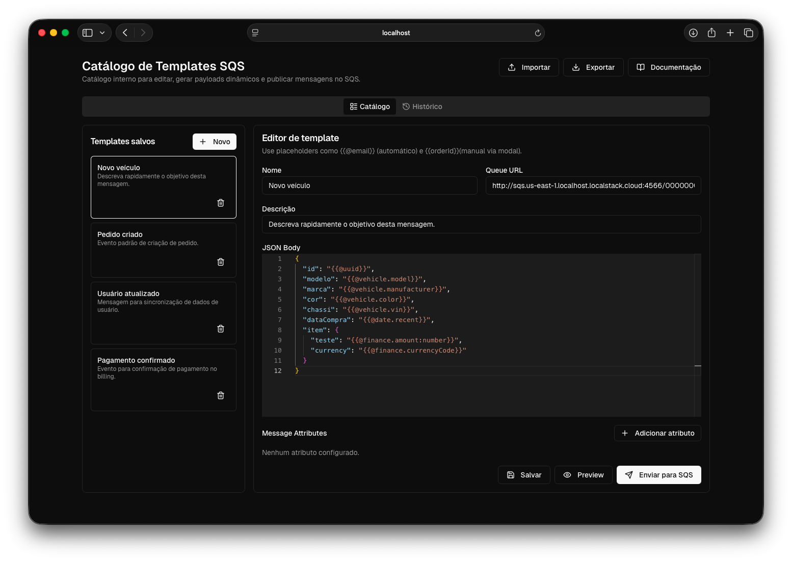

# 📨 Pigeon SQS Dispatcher


Uma aplicação web moderna desenvolvida para acelerar e padronizar o teste de microsserviços e arquiteturas orientadas a eventos. 

**Objetivo Central:** Eliminar o preenchimento manual, demorado e propenso a erros de payloads no console da AWS. O Pigeon permite que desenvolvedores e QAs criem um catálogo centralizado de templates SQS, injetem dados mockados dinamicamente em tempo de execução e façam a publicação direta nas filas com apenas um clique.

📚 **Documentação interna:** acesse em [http://localhost:3000/docs](http://localhost:3000/docs)



---

## ✨ Funcionalidades

* **📖 Gestão de Catálogo:** Crie, edite, duplique e organize templates de mensagens especificando a URL da fila, o corpo (JSON) e os `Message Attributes`.
* **🔍 Busca Fuzzy:** Filtre templates rapidamente por nome ou descrição usando busca fuzzy (powered by [Fuse.js](https://www.fusejs.io/)).
* **💻 Editor Avançado (Monaco):** O mesmo motor de edição do VS Code integrado na web, oferecendo validação de sintaxe JSON e highlight nativos.
  * **Editor Ampliado:** Expanda o editor em tela cheia para edição confortável de payloads grandes.
* **🎲 Geradores Automáticos (encapsulando Faker):** Use placeholders como `{{@email}}`, `{{@uuid}}`, `{{@person.cpf}}`, `{{@person.fullName}}`, `{{@finance.amount}}` e muitos outros.
  * **IntelliSense integrado:** O Monaco sugere os geradores assim que você digita `@` dentro do placeholder.
  * Categorias disponíveis: pessoa, localização, data, data (somente data), veículo, alfanumérico, número, finanças e internet.
* **🧠 Tipagem Declarativa no Placeholder:** Você pode declarar o tipo em `{{nome:tipo}}` ou `{{@gerador:tipo}}` com `string`, `number` ou `boolean`.
  * Ex.: `"idade": "{{idadeUsuario:number}}"` e `"ativo": "{{@boolean:boolean}}"`.
  * O parser converte o tipo e remove aspas no payload final para `number` e `boolean`.
* **✍️ Variáveis Customizadas (Inputs Manuais):** Precisa testar um ID específico? Adicione `{{orderId}}` no JSON. O app intercepta o envio e abre modal para você digitar o valor (com input adequado ao tipo declarado).
* **👁️ Preview antes de Enviar:** Visualize o payload final com todas as variáveis resolvidas antes de publicar. Confirme o envio direto pelo preview ou cancele.
* **🕒 Histórico e Re-envio:** Um log local salva os últimos disparos, mostrando o payload final (já processado com os dados reais) e o status da AWS. Re-envie qualquer mensagem com um clique.
* **🤝 Colaboração (Import/Export):** Exporte seu catálogo inteiro para um arquivo `.json` e compartilhe com o time. A importação faz um *merge* inteligente (baseado em IDs) para não apagar os templates que seus colegas já criaram localmente.
* **⌨️ Atalhos de Teclado:** `Ctrl+S` / `⌘+S` para salvar o template rapidamente.

---

## 🛠️ Tecnologias Utilizadas

* **Frontend:** Next.js (App Router), React, Tailwind CSS
* **UI/UX:** shadcn/ui, Lucide Icons
* **Editor:** `@monaco-editor/react`
* **Mock Data:** `@faker-js/faker` (encapsulado no container de geradores)
* **Busca Fuzzy:** `fuse.js`
* **Integração:** AWS SDK para JavaScript (`@aws-sdk/client-sqs`)

---

## 🚀 Como Executar o Projeto Localmente

### Pré-requisitos
* Node.js (v18+ recomendado)
* pnpm (gerenciador de pacotes)
* Credenciais da AWS configuradas com permissão de `sqs:SendMessage` nas filas de teste.

### Passo a Passo

1. **Clone o repositório:**

```bash
git clone https://github.com/douglasgusson/pigeon.git
```

2. **Acesse a pasta do projeto e instale as dependências:**

```bash
cd pigeon
pnpm install # ou npm install
```

3. **Configure as Variáveis de Ambiente:**

Crie um arquivo `.env.local` na raiz do projeto e adicione suas credenciais da AWS (nunca commite este arquivo para o repositório):

```txt
AWS_REGION=us-east-1
AWS_ACCESS_KEY_ID=sua_access_key
AWS_SECRET_ACCESS_KEY=sua_secret_key
```
_Nota: Se você utiliza perfis da AWS configurados na sua máquina (ex: em `~/.aws/credentials`), o AWS SDK Node.js geralmente consegue capturá-los automaticamente._

4. **Inicie o servidor de desenvolvimento:**

```bash
pnpm dev # ou npm run dev
```

5. **Acesse a aplicação:**

Abra [http://localhost:3000](http://localhost:3000) no seu navegador.


## 💡 Guia Rápido de Uso

1. **Criando o primeiro template:** Clique em "Novo" na sidebar, dê um nome descritivo e cole a URL da sua fila SQS.

2. **Localizando templates:** Use o campo de busca na sidebar para filtrar templates por nome ou descrição.

3. **Usando o Autocomplete:** No campo do corpo da mensagem (JSON), comece a digitar `"email": "{{@` e espere o editor sugerir os geradores disponíveis. Selecione a opção desejada.

4. **Editor ampliado:** Para payloads grandes, clique em "Ampliar" ao lado do campo JSON Body para abrir o editor em tela cheia.

5. **Salvando rapidamente:** Use `Ctrl+S` / `⌘+S` para salvar o template sem precisar clicar no botão.

6. **Preview antes de enviar:** Clique em "Preview" para visualizar o payload final com todas as variáveis resolvidas antes de enviar.

7. **Publicando:** Clique em "Enviar para SQS". Se houver variáveis manuais no seu JSON (como `{{userId}}` ou `{{idadeUsuario:number}}`), preencha o modal que irá aparecer. Em instantes, um Toast de sucesso com o `MessageId` da AWS será exibido.

8. **Tipagem explícita no payload:** para forçar tipos use `:number`, `:boolean` ou `:string` no placeholder. Exemplo completo:

```json
{
  "idade": "{{idadeUsuario:number}}",
  "ativo": "{{@boolean:boolean}}",
  "codigo": "{{codigoAcesso}}",
  "idString": "{{@uuid:string}}"
}
```

9. **Duplicando templates:** Use o botão de duplicar (ícone de cópia) em qualquer template da sidebar para criar uma cópia.

10. **Compartilhando com o time:** Use o botão "Exportar" no topo da tela para baixar suas configurações e envie para a equipe. Eles só precisam clicar em "Importar" para ter acesso às mesmas mensagens em suas máquinas locais.

---

## 🎲 Geradores Disponíveis

| Categoria | Geradores |
|---|---|
| **Pessoa** | `@person.fullName`, `@person.fullName.male`, `@person.fullName.female`, `@person.firstName`, `@person.lastName`, `@person.sex`, `@person.sex.abbreviation`, `@person.birthdate`, `@person.cpf`, `@person.phone` |
| **Localização** | `@location.country`, `@location.state.name`, `@location.state.abbreviation`, `@location.city`, `@location.zipCode`, `@location.streetAddress` |
| **Data (ISO-8601)** | `@date.past`, `@date.future`, `@date.recent`, `@date.soon`, `@date.timestamp` |
| **Data (YYYY-MM-DD)** | `@dateonly.past`, `@dateonly.future`, `@dateonly.recent`, `@dateonly.soon` |
| **Veículo** | `@vehicle`, `@vehicle.manufacturer`, `@vehicle.model`, `@vehicle.color`, `@vehicle.vin`, `@vehicle.fuel` |
| **Alfanumérico** | `@alphanumeric.short`, `@alphanumeric.medium`, `@alphanumeric.long` |
| **Numérico** | `@number.int`, `@number.float` |
| **Finanças** | `@finance.amount`, `@finance.currencyCode`, `@finance.iban` |
| **Internet** | `@email`, `@url` |
| **Outros** | `@uuid`, `@boolean` |

---

Desenvolvido para simplificar o dia a dia e focar no que importa: a qualidade e a lógica de negócio. 🚀
